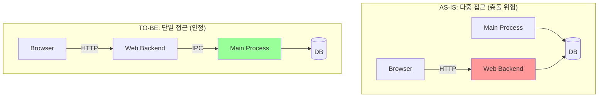

# DB & Architecture Refactoring Plan

## 1. Goal

DB 접근 로직을 **Electron 메인 프로세스로 중앙화**하고, **Feature 중심의 계층형 아키텍처**를 도입하여 코드의 안정성과 유지보수성을 극대화한다.

---

## 2. Architecture: AS-IS → TO-BE



---

## 3. Target Folder Structure

-   `features` : 기능별로 View, Service, Repository를 그룹화하여 응집도 상승
-   `common`: 여러 기능이 공유하는 Repository 및 저수준 Service 배치

```
src/
├── features/
│   └── listen/
│       ├── listenView.js             # View (UI)
│       ├── listenService.js          # ViewModel (Logic)
│       └── repositories/             # Model (Feature-Data)
│           ├── index.js              # <- 저장소 전략 선택
│           ├── sqlite.repository.js
│           └── firebase.repository.js
│
└── common/
    ├── services/
    │   └── sqliteClient.js         # <- DB 연결/관리
    └── repositories/                 # <- 공통 데이터
        ├── user/
        └── session/
```
---

## 4. Key Changes

-   **DB 접근 단일화**
    -   모든 DB Read/Write는 **Electron 메인 프로세스**에서만 수행.
    -   웹 백엔드(`backend_node`)는 IPC 통신을 통해 메인 프로세스에 데이터를 요청.
    -   웹 백엔드의 DB 직접 연결 (`better-sqlite3`, `db.js`) 코드 전부 제거.

-   **Repository 패턴 도입**
    -   모든 SQL 쿼리는 `*.repository.js` 파일로 분리 및 이동.
    -   **공통 Repository:** `common/repositories/` (e.g., `user`, `session`)
    -   **기능별 Repository:** `features/*/repositories/` (e.g., `transcript`, `summary`)

-   **Service 역할 명확화**
    -   `*Service.js`는 비즈니스 로직만 담당. Repository를 호출하여 데이터를 요청/저장하지만, **직접 SQL을 다루지 않음.**

-   **`renderer.js` 제거**
    -   `renderer.js`의 기능들을 각 책임에 맞는 View, Service로 이전 후 최종적으로 파일 삭제.

---

## 5. Future-Proofing: 저장소 전략 패턴

로그인 여부에 따라 `SQLite`와 `Firebase` 저장소를 동적으로 스위칭할 수 있는 기반을 마련한다. Service 코드는 수정할 필요 없이, Repository 구현체만 추가하면 된다.

```javascript
// e.g., common/repositories/session/index.js

const sqliteRepo = require('./sqlite.repository.js');
const firebaseRepo = require('./firebase.repository.js');

// 현재 상태에 따라 적절한 저장소를 동적으로 반환
exports.getRepository = () => {
  return isUserLoggedIn() ? firebaseRepo : sqliteRepo;
};
```

---

## 6. Design Pattern & Feature Structure Guide

각 Feature는 아래의 3-Layer 구조를 따르며, 이는 MVVM 패턴의 정신을 차용한 것입니다.

| 파일 / 폴더          | 계층 (Layer)         | 역할 (Role) & 책임 (Responsibilities)                                                                                             |
| ---------------------- | -------------------- | --------------------------------------------------------------------------------------------------------------------------------- |
| `*View.js`             | **View**             | - **UI 렌더링:** Service로부터 받은 데이터를 화면에 표시.<br>- **사용자 입력:** 클릭, 입력 등의 이벤트를 감지하여 Service에 명령 전달. |
| `*Service.js`          | **ViewModel**        | - **상태 관리:** Feature에 필요한 모든 상태(State)를 소유하고 관리.<br>- **비즈니스 로직:** View의 요청을 받아 로직 수행.<br>- **데이터 조율:** Repository를 통해 데이터를 요청/저장하고, Main 프로세스와 IPC 통신. |
| `repositories/`        | **Model / Data**     | - **데이터 추상화:** DB(SQLite/Firebase)의 복잡한 쿼리를 숨기고, Service에 간단한 함수(`getById`, `save` 등)를 제공.        |

### 확장성 가이드: 파일이 너무 커진다면?

"단일 책임 원칙"에 따라, 한 파일이 너무 많은 일을 하게 되면 주저 없이 분리합니다.

-   **Service Layer 분할:**
    -   **언제?** `listenService.js`가 STT 연결, 오디오 처리, 텍스트 분석 등 너무 많은 역할을 맡게 될 때.
    -   **어떻게?** 책임을 기준으로 더 작은 서비스로 분리합니다.
        -   `listenService.js` → **`sttService.js`**, **`audioService.js`**, **`analysisService.js`**
    -   이때, 최상위 `listenService.js`는 여러 하위 서비스를 조율하는 **"Orchestrator(조정자)"**의 역할을 맡게 됩니다.

-   **View Layer 분할:**
    -   **언제?** `AssistantView.js` 하나의 파일이 너무 많은 UI 요소를 포함하고 복잡해질 때.
    -   **어떻게?** 재사용 가능한 UI 조각으로 분리합니다.
        -   `AssistantView.js` → **`TranscriptLog.js`**, **`SummaryDisplay.js`**, **`ActionButtons.js`**

이 가이드를 따르면, 기능이 추가되거나 복잡해지더라도 코드베이스 전체가 일관되고 예측 가능한 구조를 유지할 수 있습니다.

